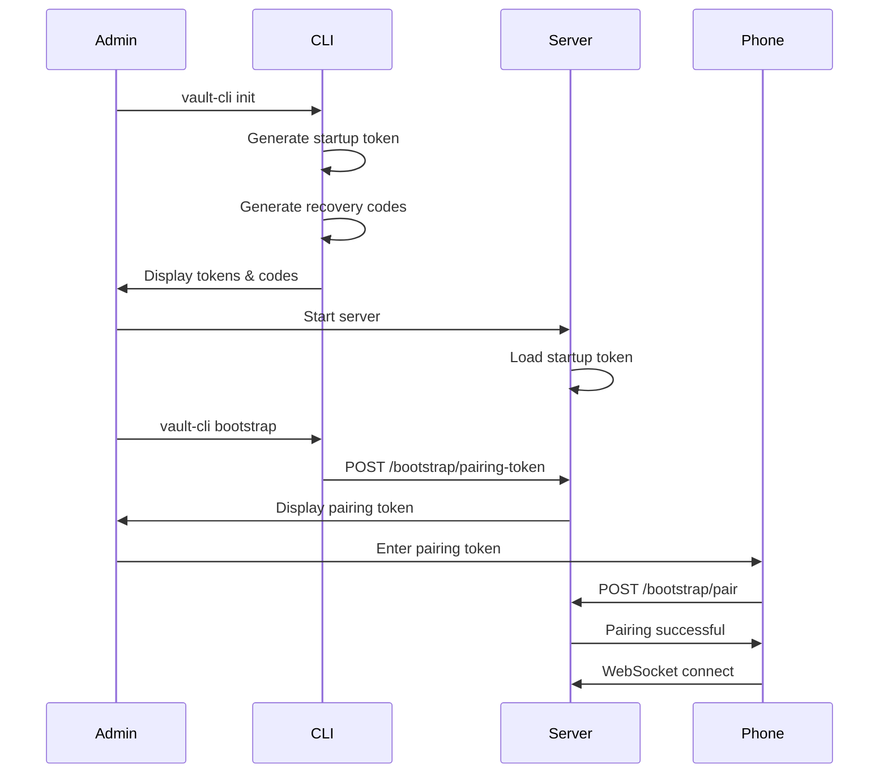
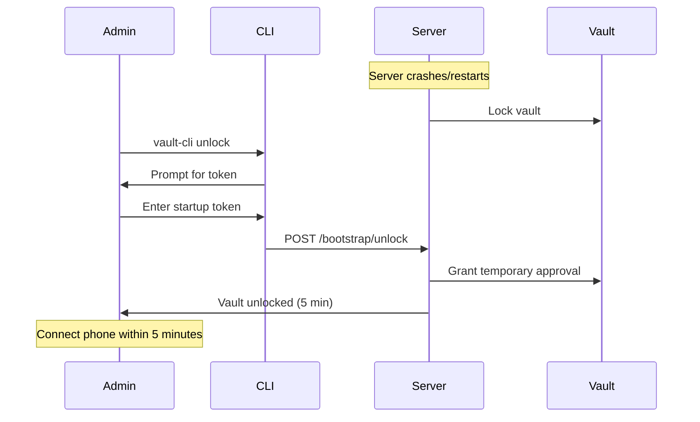
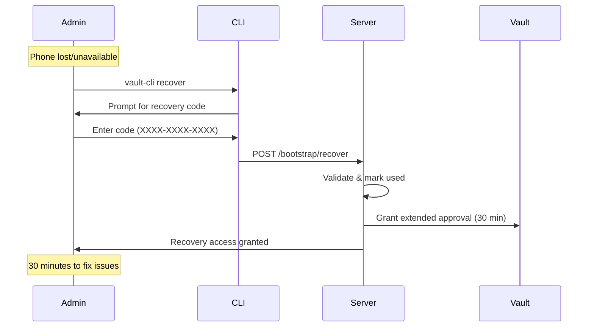

# Vault Bootstrap Guide

This guide explains how to handle the bootstrap problem - securely initializing and accessing the vault system.

## The Bootstrap Problem

The vault requires phone approval for sensitive operations, but:
1. **Initial Setup**: How do you pair the phone when the vault needs approval?
2. **Server Restart**: The vault locks on restart, but you need the phone to unlock it
3. **Emergency Access**: What if you lose your phone?

## Solution: Three-Layer Bootstrap System

### 1. 🔑 Pairing Tokens (Initial Setup)
Short-lived tokens for pairing your phone with the vault.

### 2. 🔄 Startup Tokens (Server Restarts)
Persistent tokens that survive server restarts.

### 3. 🆘 Recovery Codes (Emergency Access)
One-time codes for emergency vault access.

## Quick Start

### First-Time Setup

```bash
# 1. Navigate to server directory
cd vault/server

# 2. Initialize the vault system
npm run cli init

# This will:
# - Create secure data directory
# - Generate startup token
# - Generate 10 recovery codes
# - Save configuration

# 3. Start the server
npm run server:start

# 4. Generate pairing token for phone
npm run cli bootstrap

# 5. Enter pairing token in mobile app
```

### After Server Restart

```bash
# Option 1: Use startup token
npm run cli unlock --token YOUR_STARTUP_TOKEN

# Option 2: Read from file
npm run cli unlock --file ./vault-data/bootstrap/.startup-token

# Option 3: Use recovery code (emergency)
npm run cli recover --code XXXX-XXXX-XXXX
```

## Detailed Flows

### Initial Setup Flow



### Server Restart Flow



### Emergency Recovery Flow



## Token Types

### Pairing Token
- **Purpose**: Initial phone pairing
- **Lifetime**: 5 minutes
- **Usage**: One-time
- **Format**: Base64 URL-safe string
- **Example**: `KJ3n2_xY9Lm5Qw8...`

### Startup Token
- **Purpose**: Unlock after restart
- **Lifetime**: Persistent (regenerates on use)
- **Storage**: `./vault-data/bootstrap/.startup-token`
- **Permissions**: 0600 (owner read/write only)
- **Format**: Base64 URL-safe string

### Recovery Codes
- **Purpose**: Emergency access
- **Quantity**: 10 codes generated
- **Usage**: One-time each
- **Format**: `XXXX-XXXX-XXXX`
- **Storage**: Hashed in `./vault-data/bootstrap/.recovery-codes`
- **Example**: `A7F2-B9C4-D8E1`

## CLI Commands

### Initialize Vault
```bash
vault-cli init [options]
  -d, --data-dir <dir>  Data directory (default: ./vault-data)
```

### Generate Bootstrap Tokens
```bash
vault-cli bootstrap [options]
  -d, --data-dir <dir>  Data directory (default: ./vault-data)
```

### Unlock Vault
```bash
vault-cli unlock [options]
  -t, --token <token>   Startup token
  -f, --file <file>     Read token from file
  -s, --server <url>    Server URL (default: http://localhost:3000)
```

### Emergency Recovery
```bash
vault-cli recover [options]
  -c, --code <code>     Recovery code
  -s, --server <url>    Server URL (default: http://localhost:3000)
```

### Check Status
```bash
vault-cli status [options]
  -s, --server <url>    Server URL (default: http://localhost:3000)
```

## API Endpoints

### Bootstrap Endpoints

| Method | Endpoint | Description | Auth Required |
|--------|----------|-------------|---------------|
| POST | `/bootstrap/pairing-token` | Generate pairing token | No (if no phone connected) |
| POST | `/bootstrap/pair` | Pair phone with token | Pairing token |
| POST | `/bootstrap/unlock` | Unlock with startup token | Startup token |
| POST | `/bootstrap/recover` | Emergency recovery | Recovery code |
| POST | `/bootstrap/generate-recovery-codes` | New recovery codes | Vault approval |
| POST | `/bootstrap/generate-startup-token` | New startup token | Vault approval |

## Security Considerations

### Token Security
- **Pairing tokens** expire in 5 minutes
- **Startup tokens** regenerate after each use
- **Recovery codes** are single-use and hashed
- All tokens use cryptographically secure random generation

### File Permissions
- Bootstrap directory: `0700` (owner only)
- Token files: `0600` (owner read/write)
- Automatic permission enforcement on creation

### Audit Trail
- All bootstrap operations are logged
- Recovery code usage triggers security alerts
- Failed attempts are tracked

### Best Practices
1. **Save recovery codes** in a secure offline location
2. **Rotate startup token** periodically
3. **Monitor audit logs** for unauthorized attempts
4. **Use recovery codes** only in emergencies
5. **Re-pair phone** after recovery access

## Troubleshooting

### "Invalid or expired pairing token"
- Token expired (5 minute lifetime)
- Generate new token: `vault-cli bootstrap`

### "Invalid startup token"
- Token may have been regenerated
- Check file: `./vault-data/bootstrap/.startup-token`

### "Invalid or used recovery code"
- Code already used (single-use)
- Typo in code entry
- Generate new codes if all consumed

### "A phone is already connected"
- Disconnect existing phone first
- Or use startup/recovery token

### Server won't start
```bash
# Check for initialization
ls -la ./vault-data/

# If not initialized
vault-cli init

# If locked after crash
vault-cli unlock --file ./vault-data/bootstrap/.startup-token
```

## Example Scenarios

### Scenario 1: Fresh Installation
```bash
# Initialize everything
vault-cli init

# Start server
npm run server:start

# In another terminal, generate pairing token
vault-cli bootstrap

# Enter token in mobile app
# System ready!
```

### Scenario 2: Server Maintenance
```bash
# Before restart, ensure you have startup token
cat ./vault-data/bootstrap/.startup-token

# Restart server
systemctl restart vault-server

# Unlock vault
vault-cli unlock --file ./vault-data/bootstrap/.startup-token

# Phone reconnects automatically
```

### Scenario 3: Lost Phone
```bash
# Use recovery code
vault-cli recover
# Enter: A7F2-B9C4-D8E1

# Within 30 minutes:
# 1. Generate new pairing token
curl -X POST http://localhost:3000/bootstrap/pairing-token

# 2. Pair new phone
# 3. Generate new recovery codes
curl -X POST http://localhost:3000/bootstrap/generate-recovery-codes

# 4. Revoke old phone access (implement as needed)
```

## Integration with Systemd

Create `/etc/systemd/system/vault-unlock.service`:

```ini
[Unit]
Description=Vault Auto-Unlock
After=vault-server.service
Requires=vault-server.service

[Service]
Type=oneshot
RemainAfterExit=yes
ExecStartPre=/bin/sleep 5
ExecStart=/usr/local/bin/vault-cli unlock --file /var/lib/vault/bootstrap/.startup-token
StandardOutput=journal
StandardError=journal

[Install]
WantedBy=multi-user.target
```

Enable auto-unlock:
```bash
systemctl enable vault-unlock.service
```

## Summary

The bootstrap system solves the chicken-and-egg problem through:

1. **Initialization**: One-time setup with `vault-cli init`
2. **Normal Operation**: Phone approval for everything
3. **Restart Recovery**: Startup token for unlocking
4. **Emergency Access**: Recovery codes as last resort

This provides security while maintaining usability and recoverability.